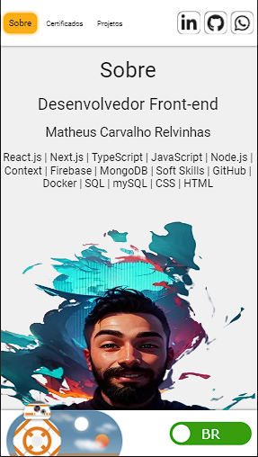

Link Project : https://portifolio-matheus-relvinhas.vercel.app/

  

Atualizei meu portifólio web, porjetos e certificados, agora ele está rodando em ios, android, além de funcionar em desktops, fiz testes em diversas plataformas. Desing novo foi muito bom para minhas habilidades de UI/UX e foi um desáfio implementar, ultilizei uiverse, um site muito bom para css.

Tecnologias:
-Next.js
-Typescript
-ContextAPI
-CSS
-HTML
